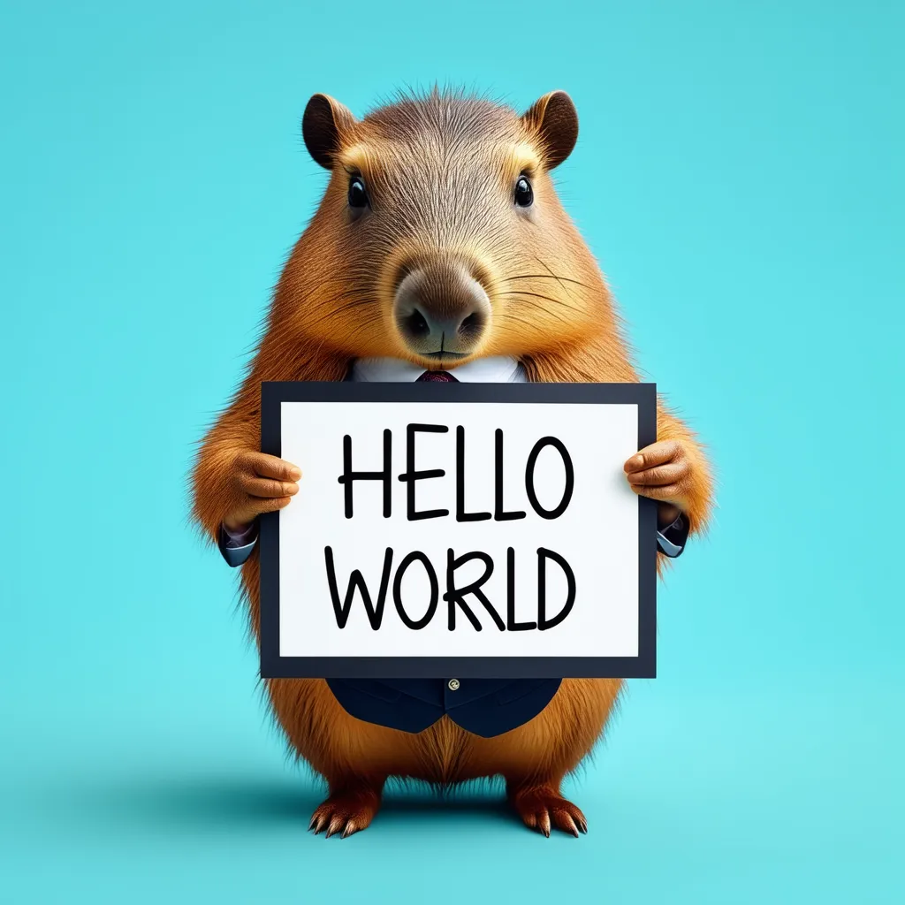

# Text to Image Pipeline

Generate images from text prompts with the [FLUX.2 Klein (4B)](https://huggingface.co/black-forest-labs/FLUX.2-klein-4B) model from Black Forest Labs. Includes optional prompt enhancement using [SmolLM2-1.7B-Instruct](https://huggingface.co/HuggingFaceTB/SmolLM2-1.7B-Instruct).



## Features

- Text-to-image generation with FLUX.2 Klein (4B parameters)
- Prompt enhancement via SmolLM2-1.7B-Instruct (optional, loaded on first use)
- Configurable seed, dimensions, guidance scale, and inference steps

## Setup

1. Install [uv](https://docs.astral.sh/uv/getting-started/installation/)
2. Install dependencies: `uv sync`
3. Run the application: `uv run streamlit run streamlit_app.py`

Models are downloaded automatically on first use (~8GB for FLUX.2 Klein, ~3.4GB for SmolLM2).

## Testing

Run the unit tests (no GPU or model download required):

```bash
uv run pytest
```
